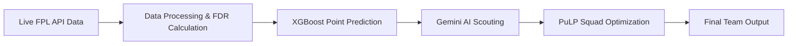

# ⚽ FPL AI-Powered Team Optimizer 🤖

**A sophisticated analytics tool that leverages machine learning and AI-driven insights to build your optimal Fantasy Premier League (FPL) squad.**  
This project goes beyond basic statistics — combining a **predictive ML model**, a **mathematical optimizer**, and **qualitative AI scouting reports** to give you a decisive edge in FPL team selection.

---

<p align="center">
  
  
  
</p>

---

## ✨ Key Features

- **📊 Live Data Integration** – Fetches real-time player data from the official FPL API for the most current stats.
- **🔮 Predictive Analytics** – Uses a pre-trained **XGBoost** model to forecast expected points (**xP**) for every player.
- **🤖 AI Scouting Reports** – Integrates with **Google's Gemini API** to provide insights on player form, injuries, and tactical roles.
- **⚙️ Optimal Squad Generation** – Uses the **PuLP** optimization library to build the best 15-player squad within budget and rules.
- **📈 Fixture Difficulty Rating (FDR)** – Calculates attacking & defensive strength to assess match difficulty.
- **🔧 Manual Overrides** – Adjust player scores with your own scouting bias in `main.py`.

---

## 🚀 System Workflow



---

## 🛠 Technology Stack

| Category      | Technology |
|---------------|------------|
| **Core Language** | Python 3 |
| **Data Science** | Pandas, NumPy, Scikit-learn |
| **Machine Learning** | XGBoost |
| **Optimization** | PuLP |
| **API & Web** | Requests, Google Generative AI, python-dotenv |

---

## 📦 Setup & Usage

### 1️⃣ Prerequisites
- Python **3.8+**
- Git
- Google AI Studio API Key (for Gemini AI scouting)

---

### 2️⃣ Installation

```bash
# Clone the repository
git clone https://github.com/your-username/your-repo-name.git
cd your-repo-name

# Create & activate a virtual environment
python -m venv venv
source venv/bin/activate  # Windows: .\venv\Scripts\activate

# Install dependencies
pip install pandas numpy xgboost pulp requests scikit-learn python-dotenv google-generativeai
```

---

### 3️⃣ Configuration

Create a `.env` file in the project root:

```env
GEMINI_API_KEY="YOUR_API_KEY_HERE"
```

(Optional) Customize `scout_overrides` and `player_team_overrides` in `main.py` to add your own bias.

---

### 4️⃣ Run the Optimizer

```bash
python main.py
```

The script outputs:
- **Starting XI**
- **Bench**
- **Captain**

---

## 📂 Project Structure

```
.
├── data/
│   └── fpl_playerstats_*.csv
├── .env
├── .gitignore
├── data_processing.py
├── fixtures.py
├── fpl_xgb_model.json
├── main.py
├── scout.py
└── README.md
```

---

## 🎯 Limitations

- **Static Prediction Model** – The XGBoost model does not retrain automatically during the season.
- **Single Gameweek Focus** – Optimizes only for the upcoming gameweek.
- **Outdated Fixtures Risk** – `fixtures.py` must be updated manually for each season.

---

## 🔮 Future Roadmap

- [ ] Automated weekly model retraining.
- [ ] Multi-gameweek lookahead for strategic planning.
- [ ] Weekly transfer & captaincy suggestion module.

---


